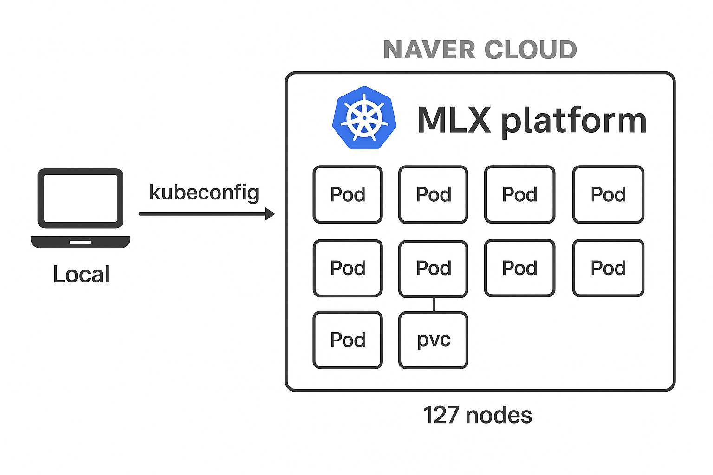

# wbl-training-tutorial

# Distributed Training with PyTorch on K8s

이 저장소는 K8s(Kubernetes)를 사용하여 PyTorch 모델의 분산 학습을 수행하기 위한 파일과 지침을 포함하고 있습니다. 제공된 예제는 Fashion-MNIST 데이터셋을 기반으로 합니다.

```
네이버 클라우드 MLX 가이드 문서: https://guide.ncloud-docs.com/docs/ai-mlxp-overview 
```

## 단계별 가이드
하기 가이드에서 로컬이란 개인 데스크탑을 의미합니다. (MLX플랫폼 웹 페이지 아님)

로컬에서 kubeconfig 를 설치하고 kubectl 명령어를 통해 NAVER CLOUD MLX Platform K8s에 명령할 수 있습니다.  
Pod 실행 시, pvc(즉, volume)를 마운트하여 학습 데이터에 접근할 수 있습니다.

## 사전 요구 사항

1. **kubectl**: K8s 클러스터와 상호 작용하도록 설치 및 구성되어 있어야 합니다. (OS에 맞게 설치하세요.)
2. **kubeconfig**: Kubeconfig는 대쉬보드에서 다운로드: https://kpb3r.mlxp.ncloud.com/ncai-wbl/ncai-wbl/home/dashboard  
   > 다운로드 받은 파일을 로컬 데스크탑의 `~/.kube/config` 파일로 복사합니다.  `cp ncai-wbl-kubeconfig.yaml ~/.kube/config`  
   > 로컬 데스크탑에서 ``` kubectl get pods ``` 명령어를 실행했을 때, 오류 없이 pod 정보들이 노출되면 정상입니다.
3. **Docker**: Docker 이미지를 빌드하기 위해 설치되어 있어야 합니다.
4. **데이터셋**: Fashion-MNIST 데이터셋이 Hugging Face Dataset 형식으로 준비되어 있어야 합니다.  
   데이터셋은 이미 볼륨에 다운로드되어 있습니다. 경로: `/data/backup/test/fashion_mnist/fashion_mnist_arrow`
5. **NAVER 클라우드 API KEY**: https://www.ncloud.com/mypage/manage/authkey URL에 접속하여 개인 API 인증키를 생성합니다. (이미 있다면 해당 키를 사용하시면 됩니다.)

## 파일 개요

- **mnist_distributed.py**: PyTorch를 사용한 분산 학습을 위한 Python 스크립트입니다. 모델 정의, 데이터 로딩, 학습/테스트 로직이 포함되어 있습니다.
- **Dockerfile**: 클라우드 환경에서 분산 학습 스크립트를 실행하기 위한 Docker 이미지를 빌드하는 데 사용됩니다.
- **pytorchjob.yaml**: PyTorchJob을 사용하여 분산 학습 작업을 배포하기 위한 K8s 매니페스트입니다.

### 1. Docker 이미지 빌드(로컬에서 실행)

제공된 `Dockerfile`을 사용하여 학습 스크립트용 Docker 이미지를 빌드합니다.

```bash
# Dockerfile이 있는 디렉토리로 이동
cd wbl-training-tutorial

# Docker 레지스트리에 로그인
docker login ncai-wbl-registry.kr.ncr.ntruss.com
# Username: Access Key Id (발급 받은 API Key의 Access Key ID)
# Password: Secret Key (발급 받은 API Key의 Secret Key)


# Docker 이미지 빌드
docker build -t ncai-wbl-registry.kr.ncr.ntruss.com/<TARGET_IMAGE[:TAG]> .

# 이미지를 컨테이너 레지스트리에 푸시
docker push ncai-wbl-registry.kr.ncr.ntruss.com/<TARGET_IMAGE[:TAG]>
# docker 이미지가 푸시 되지 않는다면 이효일, 권대욱 님에게 문의 바랍니다. (권한 이슈)
```

Docker 이미지가 성공적으로 푸시되면, 네이버클라우드 콘솔 > Container Registry에서 `ncai-wbl-registry` 하위에 이미지를 확인할 수 있습니다. (https://console.ncloud.com/ncr/registries/ncai-wbl-registry/images)

### 2. PyTorchJob 매니페스트 업데이트

`pytorchjob.yaml` 파일을 편집하여 올바른 Docker 이미지와 데이터셋 경로를 지정합니다. 아래의 플레이스홀더를 실제 값으로 교체하세요:

```yaml
image: ncai-wbl-registry.kr.ncr.ntruss.com/<TARGET_IMAGE[:TAG]>
```

> **Note:** `data_path`는 `pytorchjob.yaml` 파일에 별도의 필드로 존재하지 않습니다. 대신, `args` 섹션에서 `--data_path` 플래그를 통해 데이터 경로를 전달합니다. 예를 들어:
>
> ```yaml
> args:
> - >
>   mkdir -p /tmp/checkpoints /tmp/logs &&
>   torchrun --nnodes ${PET_NNODES} --nproc_per_node ${PET_NPROC_PER_NODE} --rdzv_id ${PET_RDZV_ID} --rdzv_backend ${PET_RDZV_BACKEND} --rdzv_endpoint ${PET_RDZV_ENDPOINT}
>   /opt/mnist/src/mnist_distributed.py --checkpoint_path /tmp/checkpoints/mnist.pt --log_path /tmp/logs --data_path /mnt/data/backup/test/fashion_mnist/fashion_mnist_arrow
> ```
MLX 플랫폼에 보이는 training-data 볼륨을 /mnt/data 경로에 마운트 하였다면 위와 같이 작성할 수 있습니다.

### 3. PyTorchJob 배포(로컬 데스크탑에서 실행하면 MLX 플랫폼의 K8s에 적용됩니다.)

PyTorchJob을 K8s 클러스터에 적용합니다:

```bash
kubectl apply -f pytorchjob.yaml
```

### 4. 학습 작업 모니터링

학습 작업 상태를 확인합니다:

```bash
kubectl get pods
```

마스터 Pod의 로그를 확인합니다:

```bash
kubectl logs <master-pod-name>
```

### 5. 체크포인트 가져오기

학습이 완료되면 모델 체크포인트가 `mnist_distributed.py` 스크립트의 `--checkpoint_path` 인수에 지정된 경로에 저장됩니다. 이 경로가 K8s 매니페스트에서 볼륨으로 마운트되었는지 확인하세요.

## 참고 사항

- `mnist_distributed.py` 스크립트는 PyTorch의 Distributed Data Parallel (DDP)을 사용하여 다중 노드 학습을 수행합니다.
- 학습을 시작하기 전에 데이터셋이 Hugging Face Dataset 형식으로 전처리되고 준비되었는지 확인하세요.
- `pytorchjob.yaml` 파일을 수정하여 리소스 요청, 제한 및 기타 매개변수를 구성하세요.

## 참고 자료

- [PyTorch Distributed Training](https://pytorch.org/tutorials/intermediate/ddp_tutorial.html)
- [Kubeflow PyTorchJob](https://www.kubeflow.org/docs/components/training/pytorch/)

## 추가 도움될 만한 자료

### K9s를 사용한 모니터링

K9s는 Kubernetes 클러스터를 CLI 환경에서 모니터링할 수 있는 도구입니다. 다음은 설치 및 사용 방법입니다:

1. K9s 설치:
   ```bash
   # Linux 기준 설치 명령어
   curl -sS https://webinstall.dev/k9s | bash
   ```

2. K9s 실행:
   ```bash
   k9s
   ```
   K9s를 실행하면 CLI 환경에서 클러스터의 리소스를 실시간으로 모니터링할 수 있습니다.

### OpenLens를 사용한 UI 기반 모니터링

OpenLens는 Kubernetes 클러스터를 UI 환경에서 관리할 수 있는 도구입니다. 다음은 설치 및 사용 방법입니다:

1. OpenLens 설치:
   - OpenLens는 [공식 GitHub 페이지](https://github.com/MuhammedKalkan/OpenLens)에서 다운로드할 수 있습니다.
   - 운영 체제에 맞는 설치 파일을 다운로드하여 설치를 진행합니다.

2. OpenLens 실행:
   - OpenLens를 실행한 후, `kubeconfig` 파일을 추가하여 클러스터에 연결합니다.
   - 클러스터의 리소스를 시각적으로 확인하고 관리할 수 있습니다.

이 두 가지 도구를 활용하면 Kubernetes 클러스터를 더욱 효율적으로 모니터링하고 관리할 수 있습니다.